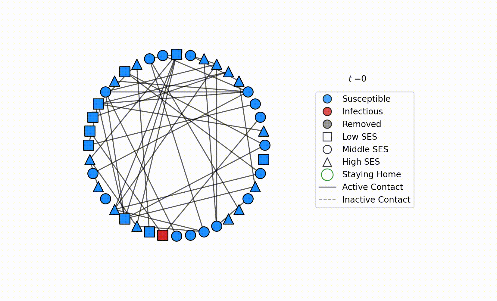
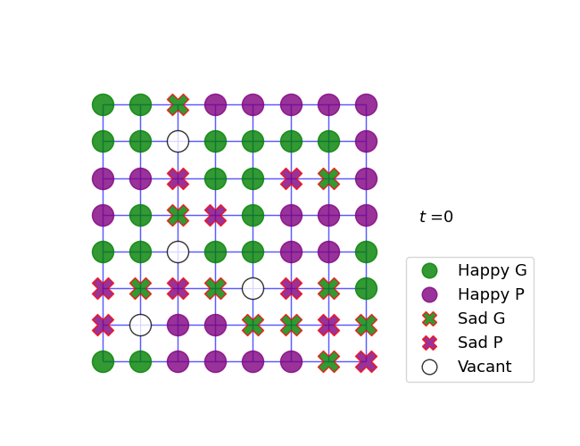

# Background {-}
I have created some cool data visualizations and schematic model descriptions, mostly using Python and matplotlib.
I store them here for futere references.

#  Epidemics in Dynamic Networks of Segregated Communities

<!-- - This project will result in the production of a relational -->
<!-- spatially-enabled database integrating all known surface water, ground -->
<!-- water, and water quality data for the middle Rio Grande basin study -->
<!-- area. -->
<!-- $hi+2$ -->
<!--     - Additionally, `Visual Basic for Applications (VBA)` code and -->
<!-- Structured Query Language (SQL) code are products of the project.All -->
<!-- updateable datasets are acquired from the original data source (for -->
<!-- example, EPA websites). -->
<!--     - Updatable data sources are acquired at specified intervals – quarterly, or as needed. -->
<!--     - As new static data sources are discovered, they will be integrated into the proposed compendium. -->
<!-- Data will be processed using dataset‐specific VBA programs. Program file comment headers will be included in the code to explain required input variables, purpose of the program, and requirements needed by the user. -->
<!--       - Code will be annotated to promote code readability. -->

#  Schelling Model

#  Karate Club
<!-- {width: 10px;} -->

[See, for example, @Briney_2015]

#  Epidemics on Empirical Dynamic Networks

Generated by my software [EPYC](https://github.com/Sepante/Epyc), Used in @sajjadi_impact_2020.

# References {-}