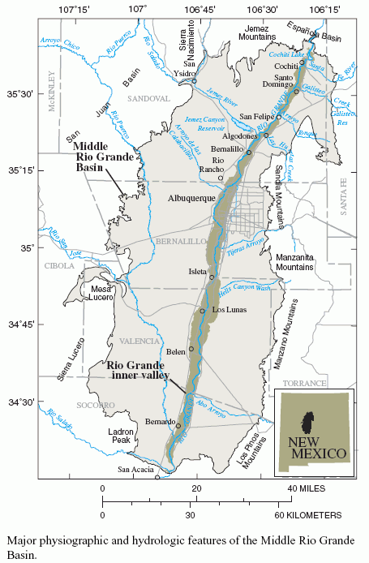

```{r read-usgs-data, echo =FALSE}
usgs <- read.csv("data/usgs.csv")

```


# Data Management Plan: Rio Grande Basin Hydrologic Geodatabase Compendium {-}

# Background {-}

The field area for this investigation is shown in Figure 1 below.[Source: @Bartolino_1979 citation goes here]

. 

This map was compiled from `r nrow(usgs)` sampling sites.


# Types of Data Produced

This project will result in:

- the production of a relational spatially-enabled database integrating all known surface water, ground
water, and water quality data for the middle Rio Grande basin study
area. 
- Additionally, Visual Basic for Applications (VBA) code and Structured Query Language (SQL) code are products of the project. 
- All updateable datasets are acquired from the original data source (for example, EPA websites). 
- Updatable data sources are acquired at specified intervals – quarterly, or as needed. 
- As new static data sources are discovered, they will be integrated into the proposed compendium. 
    - Data will be processed using dataset‐specific VBA programs. 
    - Program file comment headers will be included in the code to explain required input variables, purpose of the program, and requirements needed by the user.
    - Code will be annotated to promote code readability.

# Data and Metadata Standards

`Microsoft Access Database` format will be used since it is
readily-accessible and it is compatible with [`ESRI ArcGIS`](http://www.esri.com/software/arcgis/index.html), a Geographic
Information System software package used by the stakeholders. Naming
conventions will be consistent – no spaces will be used in table names
or field names. The file naming convention will consist of the data
source_data type format for raw data files. Data reporting
functionality will be built into the VBA processing programs to provide
output in `.txt` file format for number of records per source when
updatable data sources are refreshed.

Every effort will be made to go back to the authoritative source for an
identified dataset. Quality control of the database will be performed
using SQL statements that capitalize on the database structure to ensure
relational database integrity. Appropriate primary keys will be assigned
to manage possible data duplicates. Potential duplicate site IDs, will
be handled through automated procedures and the creation of alternate ID
tables.

A data dictionary will be created that defines the table definition,
table fields, and table field data types. An entity-relationship diagram
will be created that defines the relational structure of the database. A
metadata record will be produced using the FGDC standard that describes
the entire geodatabase. ^[The FGDC standard was chosen due to required Federal government
standards].


# Policies for Access and Sharing

The data are __public__ and will be obtainable thru the _New Mexico
Interstate Stream Commission (NMISC)_. Users of the data will primarily
be water (H~2~o) resource managers in the Rio Grande Basin. USGS publications
will be released describing the methods and data sources and can be used
as documentation for the data and to cite the data.

# Policies for Re-use, Distribution

Access to databases and associated software tools generated under the
project will be available for educational, research and non-profit
purposes. Such access will be provided using web-based applications, as
appropriate.

Materials generated under the project will be disseminated in accordance
with University/Participating institutional and NSF policies [See, for example, @Briney_2015]. Depending
on such policies, materials may be transferred to others under the terms
of a material transfer agreement.

The data files have a suggested citation, which will be described in the
metadata in addition to the USGS publications.

# Plans for Archiving and Preservation

1. All original raw data files and data source processing programs will be versioned over time and maintained in a date-stamped file structure with text files documenting the provenance. 
1. The database will be preserved in perpetuity, housed initially at the New Mexico Interstate Stream Commission Central Office in addition to an off-site copy maintained at an NMISC field office and mirrored at the Consortium of Universities for
the Advancement of Hydrologic Science (CUAHSI). 
1. We will also identify appropriate archiving institutions that might serve as a mirror
repository. 
1. A data policy and stewardship plan will be established. 
    a. In addition to archiving, each database table will be exported to a
delimited text format to ensure accessibility of the data by other
software programs. 
    a. The data manager at the NMISC will be responsible for the management of long-term storage and archived data.
    
# Appendixes {-}

## Supplementary data {-}


```{r usgs-data-table, echo = TRUE}
str(usgs)

```


### Distribution rights {-}

```{r creative-commons-license, include=FALSE}
# Point your browser to the Creative Commons website at https://creativecommons.org/choose/
# Answer the questions on the page
# Copy the HTML code for the license you have selected below this code chunk
# Knit to HTML to see the final report with an open access license enabling wide distribution and sharing!
```

<a rel="license" href="http://creativecommons.org/licenses/by-nc-sa/4.0/"></a><br /><span xmlns:dct="http://purl.org/dc/terms/" href="http://purl.org/dc/dcmitype/InteractiveResource" property="dct:title" rel="dct:type">My Data Management Plan</span> by <a xmlns:cc="http://creativecommons.org/ns#" href="https://authorcarpentry.github.io/markdown-pandoc-Gail/" property="cc:attributionName" rel="cc:attributionURL">Gail Clement</a> is licensed under a <a rel="license" href="http://creativecommons.org/licenses/by-nc-sa/4.0/">Creative Commons Attribution-NonCommercial-ShareAlike 4.0 International License</a>.

# References {-}